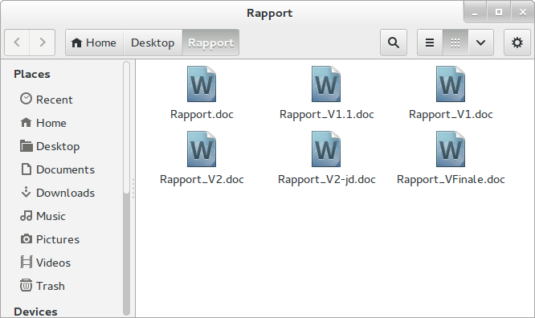
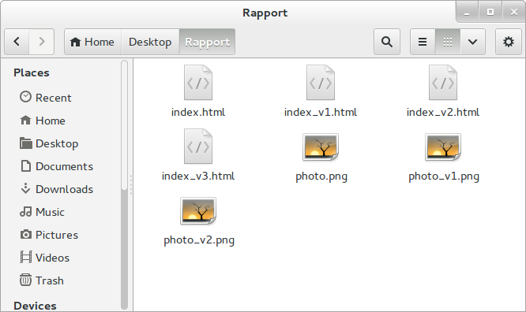
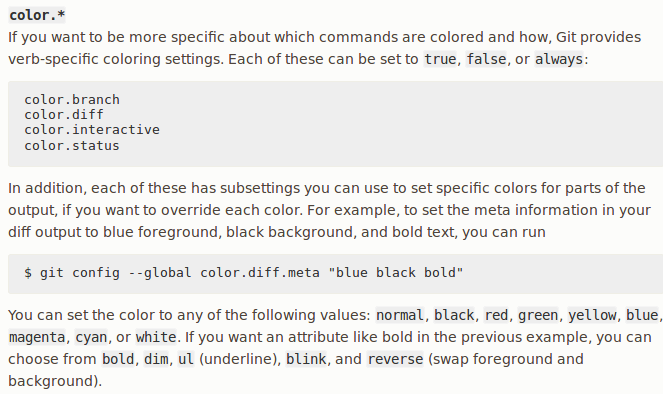
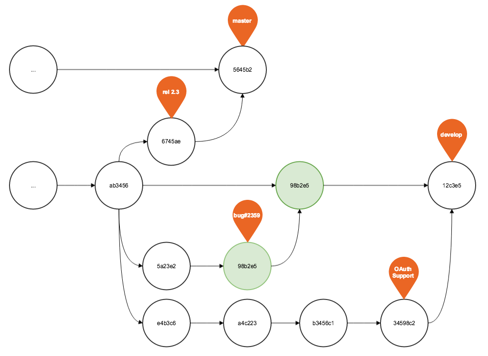
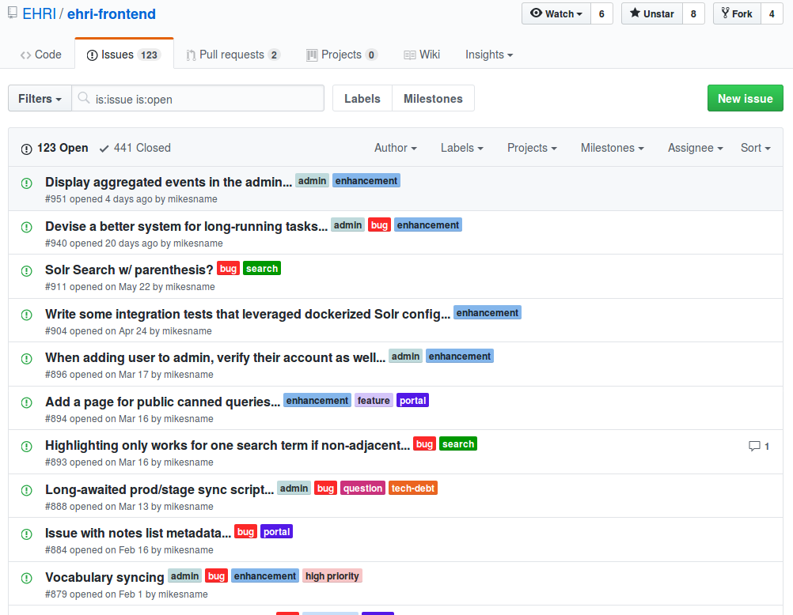
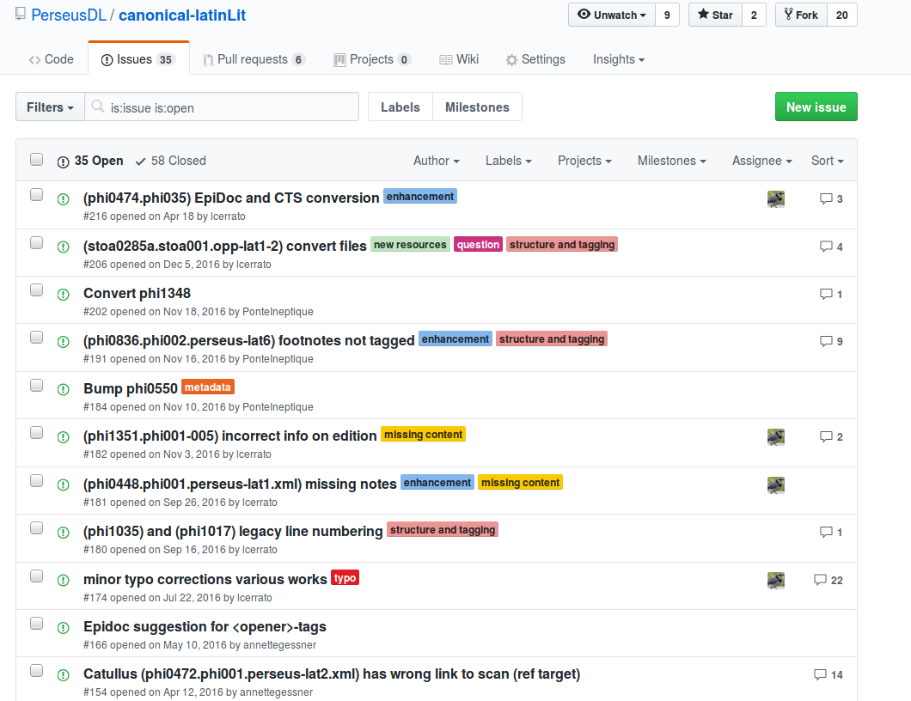
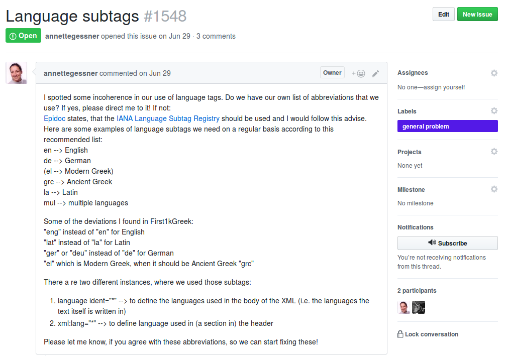
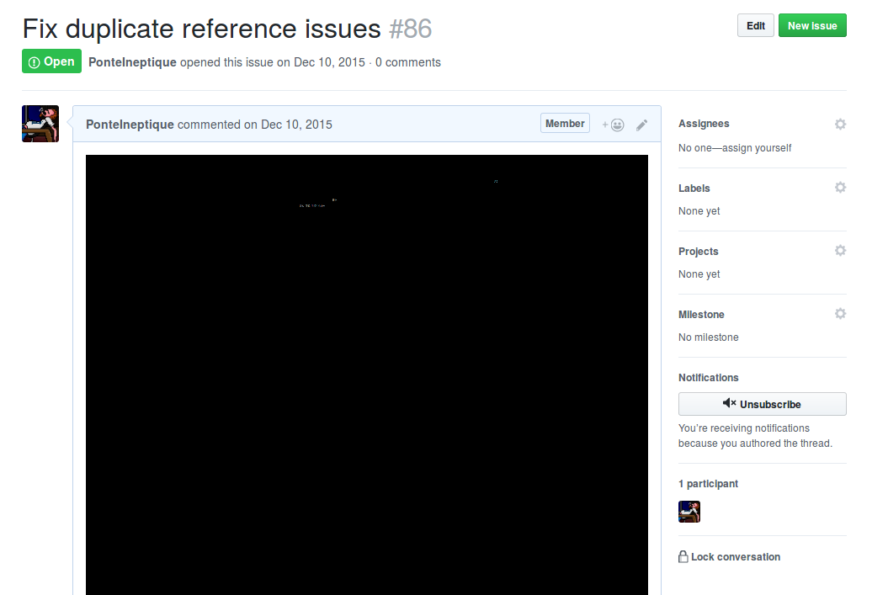
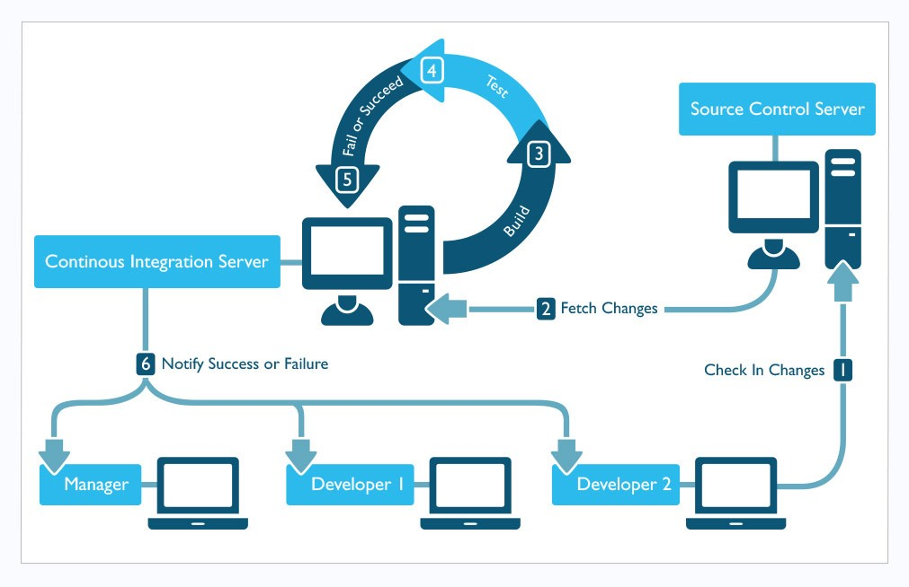
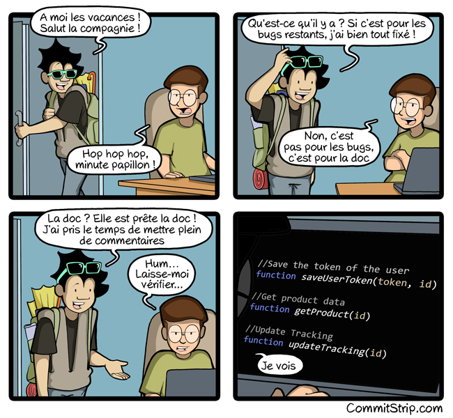

# Cours pour apprendre Git et ses bonnes pratiques

## Sommaire
    Git : Historique, commandes de base
    Git : Les branches
    Git : Serveur distant
    Git : Github
    Développer en ligne et en équipe: intégration continue et tests
    Bonnes pratiques
    Qu'est-ce que le gitignore ?


# Git : Historique, commandes de base

## 1. Problème



---

## 2. Problème


---

## 2bis. Problèmes combinés

À partir de ces documents donc, d'après vous, quels besoins éprouvent les utilisateur-rice-s ?



---

## 3. Problème(s)

- À partir de ces documents, les besoins éprouvés peuvent être :
	- Comprendre les versions
	- Pouvoir revenir en arrière, avoir une "trace"
	- Pouvoir avoir une collaboration simple

---

## 4. Git : un outil de versionnage

- Date d'avril 2005, créé par le créateur du noyau Linux Linus Torvalds et par Junio Hamano
- Sous licence libre GNU GPLv2
- Version 2 actuellement
- Autres outils : 
	- connus : CVS, SVN (Subversion)  
	- moins connus : Mercurial, Bazaar

---

## 5. Git : Principes généraux

- Travail dans un *repository* (dépôt en français) == un dossier
	- Il contient un dossier (souvent caché) `.git` qui contient toutes les archives enregistrées
- Contrairement à Dropbox ou Google Drive, pour qu'une modification soit archivée, il faut que cela soit explicité
	- Ces modifications archivées sont appelées "commit"
	- Elles portent un message enregistré par l'utilisateur
	- Elles peuvent comporter plusieurs fichiers
	- Les fichiers qui ont subi des modifications doivent y être ajoutés explicitement

---

## 6. Git : Principes généraux

On distingue trois "états" des fichiers

- un état de travail : le fichier a subi des modifications, mais nous ne l'avons pas encore ajouté (`add`) à un futur commit
- un état de futur enregistrement : le fichier a été ajouté (`add`) à un commit, mais le commit n'a pas été finalisé avec un message
	- Appelée *staging area*, ou *stage*
- un état archivé : le fichier a subi des modifications enregistrées et n'a pas été modifié depuis lors.


---

## 7. Git : Commandes principales

- **Initialisation** : `git init`
- **Ajout de modifications** : `git add [Nom du fichier]` ou `git add -A` (Ajout de tous les fichiers changés)
- **État du dépôt** : `git status` (donne la liste des modifications réalisées)
- **Enregistrement de modifications** : `git commit -m "Message du commit"`. N'oubliez jamais le -m à moins de vouloir passer un mauvais moment.
- **Historique du repository** : `git log`
- **Différence entre l'état archivé et l'état actuel** : `git diff` pour une différence détaillée, `git status` pour un point général.

---

## 8. Changer les couleurs si difficiles à lire



---

## 9. Importance des messages


---

## 11. Précisions techniques

Contrairement à ce que l'on pourrait penser, Git n'archive ou ne sauvegarde pas vos fichiers. Ce qu'il sauvegarde, ce sont les modifications apportées à des fichiers. Par exemple, si je crée un fichier toto.txt qui contient "toto" en ligne 1, il enregistrera:

```
-> Nouveau(toto.txt)
-> Content(toto.txt, "toto")
```

Si ensuite, j'ajoute une nouvelle ligne:

```
-> Content(toto.txt, "\nune nouvelle ligne")
```

Où `\n` est un retour à la ligne.

# Les branches
## 1. Les branches

- Les branches sont comme des "Sauvegarder sous..." pour l'ensemble du dépôt
    - Sauf qu'on peut les rejoindre/fusionner plus facilement !
- La branche par défaut s'appelle master
    - Dans `git status`, la branche `master` doit être affichée dans votre dossier de notes
- Offre la possibilité de travailler sur différents problèmes en parallèle. Possibilité de travailler sur des problèmes différents en même temps et de changer de tâche rapidement.
    - Une branche Master
    - Une branche bug 1
    - Une branche bug 2 parce que celui-ci est plus pressé
    - etc...

---

## 2. Les branches : vocabulaire et commandes

- **Créer une branche** : `git branch [nom de la branche]`
- **Se déplacer dans une branche** : `git checkout [nom de la branche]`
- **Se déplacer et créer une branche en même temps** : `git checkout -b [nom de la branche]`
- **Fusionner une branche** : `git merge [branche dont on veut les modifications]` (on fusionne toujours depuis la branche réceptrice, celle sur laquelle on veut continuer de travailler ensuite)

---

## 3. Branches



# Git : Serveur distant
## 1. Ce qu'il manque jusque là

- Capacité de sauvegarde distance : dois-je faire une copie dans ma dropbox ?
- Capacité de travailler en équipe : dois-je faire un git dans ma dropbox et partager le dossier ?
- etc.

---

## 2. Git et ses services en ligne

Des entreprises et des structures du public fournissent des serveurs centralisés pour git :

- [Github](https://github.com) qui est le plus à la mode et que nous utiliserons
- [Gitlab](https://gitlab.com) qui est le concurrent le plus sérieux de github aujourd'hui
- [Bitbucket](https://bitbucket.org)
- [Forge](https://forge.git.cnrs.fr) pour le CNRS

---

## 3. Un dessin vaut mieux qu'une explication


---

## 4. Le vocabulaire des serveurs distants pour Git

- *Remote* : Serveur distant permettant la synchronisation manuelle de votre dépôt
- *origin* : Nom du serveur principal, un peu comme master est la branche principale. Pour l'instant, nos serveurs n'en ont pas
- *push* : Envoyez les modifications effectuées sur un serveur donné.
- *pull* : Retrouvez les informations depuis un serveur donné
- *clone* : Copie sur votre PC d'un dépôt trouvé en ligne
- *fork* : dérivé d'un dépôt d'un-e autre développeur-se
- *upstream* : Par convention, nom d'un second serveur, généralement le serveur source du *fork*

---

## 5. Créons un compte Github 

- Github a des défauts (pas open source par exemple) mais reste l'outil le plus moderne pour de la gestion de code versionné en équipe
- Github propose un environnement complet
	- Gestion d'équipe
	- Connexions à d'autres applications
	- Gestion de ticket
	- Gestion de fusion de branches
	- etc.

---

## 6. Ajoutons nos notes de cours en ligne

1. Créer un repo "notes-de-cours"
	- **/!\ Surtout ne pas cocher initialiser le repository**
		- Pourquoi ?
2. Ajouter ce serveur à votre dépôt local
	- `git remote add origin [adresse du serveur]`
3. Pour le premier push de synchronisation
	- `git push -u origin master`
		- Git, envoie ma branche actuelle sur la branche master du serveur origin. (-u:) Cette branche correspondra à partir de maintenant à celle sur mon dépôt local
	- `git push` sera suffisant (pour la branche master !) à partir de maintenant.

---

## 7. Cloner un repository

Un dépôt git en ligne est peu ou prou la même chose qu'un dépôt git local sauf que vous ne pouvez pas commit directement dessus. Il s'agit de l'archive ".git" de votre dépôt avec la capacité de se connecter et de synchroniser ces informations. 

Tous les dépôts git ne sont **pas disponible en écriture**. Il se peut qu'un repository git distant soit protégé pour n'être complété que par tel groupe de personne.

Cependant, cela n'empêche pas de les **cloner** et de travailler dessus localement. Vous ne pourrez juste pas modifier le Git distant (remote)

---

## 8. Bonnes pratiques...

... quand on travaille avec plusieurs postes avec un dépôt distant

- Toujours faire un git status en se connectant sur son dossier
- Suivi d'un `git pull` si vous avez travaillé dessus depuis un autre poste ou depuis votre PC
- Essayez le plus possible de ne pas travailler dans la master mais dans des branches focalisées sur un objectif dès que votre projet commence à grossir

# Git : Github
## 1. Github, gitlab, etc. : pourquoi ?

- Serveur distant
- Gestion d'équipe et de projets
	- Comptes utilisateurs
	- Comptes organisations
	- Équipes aux niveaux repository et organisations
- Gestion de bug et de tickets (Issues)
- Gestion de fusion de branche et de "review"

---

## 2. Github : les issues

- Un bug : on donne alors un titre au bug
	- si c'est dans le cadre d'un logiciel/d'une application/d'un site, on donne la démarche pour le reproduire 
	- on pense à donner les fichiers concernés par le bug
	- on essaye de décrire au mieux le problème. Même si c'est sur notre propre dépôt.
		- Sinon, on oublie le bug, on revient deux mois plus tard, on sait plus ce que c'est.

---

## 3. Github : les issues

- une nouveauté : on veut une nouvelle fonctionnalité, un nouvel ensemble de données
	- on décrit correctement ce que l'on veut, de manière à pouvoir transférer la charge ou s'en occuper soi-même plus tard
- une discussion : on essaye de comprendre un morceau de code, etc.

---

## 4. Github : les issues

- Les issues peuvent être **attribuées** à des membres du dépôt : si je travaille avec @vincentjolivet, et qu'un bug le concerne, je peux lui attribuer en tant que membre. Sinon, en voyant un bug qui me concerne, je peux me l'attribuer.
- Les issues peuvent avoir des **labels**. Une série de labels par défaut existe, mais on peut tout à fait en ajouter à ses propres dépôts.
- Les issues peuvent faire l'objet de regroupement dans des **projects** (sans deadline), des **milestones** (objectifs de sortie d'une nouvelle version).

---

## 5. Github : les issues d'un repo logiciel



---

## 6. Github : les issues d'un repo data



---

## 7. Github : un exemple de bonne issue



---

## 8. Github : un exemple de mauvaise issue



---

## 9. Les dépôts dérivés (forks)

- Les données de https://github.com/chartes/elec vous intéresse. Mais vous aimeriez changer une partie des données : ne conserver que les testaments de poilu et supprimer les éléments qui ne correspondent pas à vos besoins.
- À ce moment-là, on va réaliser un **fork** du repository sur son propre compte. On obtient ainsi les droits d'écritures sur le repository tout en gardant l'ensemble de son historique. On travaille sur ce repository ensuite localement, comme on travaillerait avec n'importe quel repository.
- **Note:** Si l'on fait des modifications sur un dépôt d'une autre personne, il est plus respectueux de faire un fork que de télécharger et de créer un nouveau dépôt.

---

## 10. Collaborer : les *pull requests*

- Une *pull request* (Vocabulaire de *github*) est une demande d'autorisation de contribution à un dépôt.
- Une pull request se fait entre deux branches, comme un merge. Cependant, cela peut être deux branches de deux forks.
- Contribuer à un repository ? 
	- Non seulement j'aide la personne et les utilisateurs du repository
	- Mais en plus j'apparais sur l'historique

---

## 11. Collaborer : les *pull requests* (Histoire exemple)

-  Je remarque une erreur dans les métadonnées d'un document
	1. J'ouvre une issue qui explique le problème (Typo dans le fichier X, etc.)
	2. Parce que je veux être encore plus utile, je veux proposer la modification pour que le propriétaire n'ait pas à faire la correction lui-même
	3. Je fais un fork du dépôt du cours
	4. Je crée une branche spécifique et je rentre dessus
		- Tips : quand on fait une branche pour un objectif particulier, on l'appelle du nom de l'issue pour se souvenir de pourquoi on a créé cette branche
	5. Je fais la modification et je la commit
	6. Je push
	7. Je fais une pull request sur le repository d'origine

---

# Développer en ligne et en équipe: intégration continue et tests
## 1. Question 

- Quand on développe avec une équipe, quels risques encourons-nous ?

---

## 2. Réponses

- Quand on développe avec une équipe, quels risques encourons-nous ?
	- Introduction d'un bug par la modification d'un équipier
	- Modification du code qui passe inaperçue (Risque de duplication des efforts)
	- Erreur dans la manière de modifier le bug

---

## 3. Solutions

- Les *Pulls requests* règlent le problème du code qui passe inaperçu ou
- Les outils d'intégration continue règlent le problème des modifications et de l'introduction de bug

---

## 4. Principe

1. Vérifier à chaque modification que celle-ci n'entraîne pas de bug ou de régression
2. Vérification décentralisée et disponible pour l'ensemble de l'équipe
	- contrairement à une batterie de test local, tout le monde peut voir les résultats
3. Notification de l'ensemble de l'équipe en cas de problème ou de réussite
4. Un bug trouvé le plus tôt possible est un bug qui ne coûte pas cher.

---

## 5. Principe



---

## 6. Les tests

- Tous les langages de programmation avancés ont des logiciels de tests : php, python, java, etc.
- On distingue plusieurs types de test :
	- Les tests unitaires : on vérifie qu'un morceau de code particulier a un résultat particulier. Exemple : conjuguer(chanter, je, présent, indicatif): je chante.
	- Les tests d'intégrations : on vérifie qu'un ensemble de blocs fonctionne bien ensemble. Exemple : si je clique sur le bouton conjuguer, la fonction conjuguer est appelée et je vois le résultat,
	- etc..
- Écrire des tests représente une augmentation du temps de travail importante au départ. Cependant, un code testé vous signale tout de suite quand un changement opéré produit un problème. C'est une meilleure manière de découvrir un problème que d'avoir à cliquer sur tous les liens de toutes les pages de votre site.

---

## 7. Les tests

- Dans certains cas, on peut parler de TDD : Test Driven Development. 
	- Le principe : On écrit d'abord un test avant d'écrire la fonction.
	- Écrire le test veut dire que l'on est sûr de ce que l'on veut obtenir. C'est un moyen de se rendre compte de la limite de la compréhension de notre code ou de notre mission.
	- Lorsque j'écris un fichier XML avec un schéma prédéfini, je fais en fait une sorte de TDD. En soit, j'établis un résultat attend tel que TEI > text > body > div, et si je fais TEI > text > body > lg, une erreur est affichée.


# Bonnes pratiques
## 1. Quelles bonnes pratiques ?

---

## 2. Former et se former


---

## 3. Ne jamais travailler sur master.

---

## 4. Une Issue = Une Branche = Une Pull Request

- Ne jamais, surtout jamais fusionner ses propres PR en équipe
- Ne pas merge avant que l'intégration continue ait terminé

---

## 5. Une fonction = (> 1) test 

---

## 6. Ne pas développer ce qui existe déjà

- Sauf si l'outil fait 150 MO à la place des 10ko que vous avez en tête

---

## 7. Améliorer, contribuer 


---

## 8. Penser à votre moi du futur

- Ille sera tout autant en colère que vos collègues

---

## 9. Mettez-vous d'accord sur des bonnes pratiques

---

## 10 Indenter


---

## 11. Documenter.

---

## 12. Documenter.



---

## Liens

[Hive Best Practices https://github.com/wearehive/project-guidelines](https://github.com/wearehive/project-guidelines) pour Git

[https://code.tutsplus.com/tutorials/top-15-best-practices-for-writing-super-readable-code--net-8118](https://code.tutsplus.com/tutorials/top-15-best-practices-for-writing-super-readable-code--net-8118) pour le php

# Qu'est-ce que le gitignore ?
## Le fichier .gitignore

---


Git c'est bien, mais on ne veut pas toujours mettre à disposition toutes ses sources. Par exemple, le fichier qui comprend les mots de passe des bases de données, des fichiers caches ou compilés, etc.

Git fournit bien évidemment un outil pour ça: le fichier `.gitignore`. 

---

## Où le stocker

Ce fichier se nomme forcément `.gitignore` (Il commence donc par un point !). Il se trouve à la racine du dépôt par défaut mais vous pouvez spécifier plusieurs gitignore qui auront toujours un effet sur le dossier courant et ses descendants.

---

## Syntaxe 

Voici un exemple de fichier .gitignore :

```gitignore
*.txt
dossier/
dossier2/*.jpg
motdepasse.csv
```

---

| Ligne | Effet |
| ------- | ------ |
| `*.txt` | Cette ligne permettra d'ignorer tous les fichiers textes où qu'ils soient |
| `dossier/` | Cette ligne ignorera l'ensemble du contenu de `dossier` et par extension, le dossier lui-même (Git ne conserve pas les dossiers vides) |
| `dossier2/*.jpg` | Cette ligne ignorera les *.jpg dans le dossier2. Par contre, si dossier2 a des enfants (dossier2/sousdossier1) et des jpg à l'intérieur, il seront versionnés |
| `motdepasse.csv` | Cet ligne permet d'ignorer le fichier motdepasse.csv dans le dossier principal |

---

## Aller plus loin 

- [*Ignoring Files*, Github](https://help.github.com/articles/ignoring-files/)
- [Répertoire d'exemples de gitignore répartis par langages, Github](https://github.com/github/gitignore)