# Exercices HTML5

Vous trouverez ci-après des exercices sur le langage de balisage HTML. Les exercices balaient de nombreuses notions. La lecture de l'ensemble des chapitres vous permettra de résoudre les exercices les plus complexes. Ils ne sont pas triés par ordre de difficulté. Que la force soit avec vous !

# Exercice 1

Transformer la suite de paragraphes en une liste à puces.

``` html
<body>
   <h1>Mes cocktails préférés</h1>
   <p>Mojito</p>
   <p>Gin Fizz</p>
   <p>Bloody mary</p>
   <p>Long Island Iced Tea</p>
</body>
```
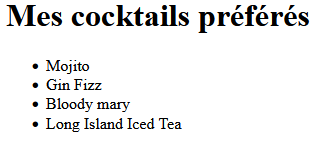

# Exercice 2

Corriger les problèmes.

``` html
<body>
   <h1>Mes <span>cocktails<h1> préférés</span>
   <p>Mojito</p>
   <p>Gin Fizz</p>
   <p>Bloody mary<p>
   <p>Long Island Iced Tea</p>
</body>
```
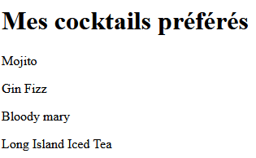

# Exercice 3

Ajouter un lien dans les paragraphes pour les différents cocktails.

``` html
<body>
   <p>Le Moscow mule est un cocktail à base de vodka, de bière de gingembre épicée et de jus de citron vert, accompagné d'une rondelle de citron.</p>
   <p>Le Long Island Iced Tea est un cocktail à base de tequila, de gin, de vodka, de rhum et de liqueur d'oranges.</p>
</body>
```


# Exercice 4

Ajouter un texte alternatif à l'image.

``` html
<body>
   <p>Un French Connection est un cocktail composé de parts égales de cognac et d'amaretto.</p>
   <p></p>
</body>
```


# Exerice 5

Ajouter une barre horizontale entre le titre et le paragraphe.

``` html
<body>
   <h1>Mon super titre</h1>
   <p>
      Lorem ipsum dolor sit amet, consectetur adipiscing elit, sed do eiusmod tempor incididunt ut labore et dolore magna aliqua. Ut enim ad minim veniam, quis nostrud exercitation ullamco laboris nisi ut aliquip ex ea commodo consequat.
   </p>
</body>
```


# Exercice 6

Faire en sorte qu'à l'intérieur des paragraphes, chaque vers du poème soit sur une ligne.

``` html
<body>
   <p>
      Prends mon cœur, il est à toi mon amour 
      Depuis longtemps j'en avais fait ton bien : 
      Il est sensible, il te sera fidèle toujours ; 
      Rien ne pourra jamais le séparer du tien.
   </p>
   <p>
      Toujours fidèle au serment qui nous lie, 
      D'un feu constant je brûlerai pour toi : 
      Le Ciel te fit pour embellir ma vie ; 
      Mon bonheur est de vivre sous ta loi.
   </p>
</body>
```
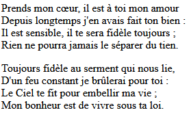

# Exercice 7

Construire un tableau avec la liste des pays et des capitales du Benelux.

``` html
<body>
   <table>
      <tr>
         <th>Pays</th>
         <th>Capitale</th>
      </tr>
      <tr>
         <td>Belgique</td>
         <td>Bruxelles</td>
      </tr>
      <tr>
         <td>Pays-Bas</td>
         <td>Amsterdam</td>
      </tr>
      <tr>
         <td>Luxembourg</td>
         <td>Luxembourg</td>
      </tr>
   </table>
</body>
```
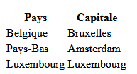

# Exercice 8

Ajouter des liens sur le numéro de téléphone et l'adresse e-mail.

``` html
<body>
   <h1>Mairie de Melun</h1>
   <p>Téléphone : 01 64 52 33 03</p>
   <p>E-mail : mairie@ville-melun.fr</p>
</body>
```
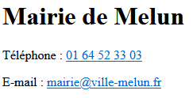

# Exercice 9

Ajouter au formulaire une liste déroulante avec 3 cocktails de votre choix.

``` html
<h1>Mon formulaire</h1>
<form></form>
```
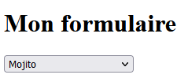

# Exercice 10

Modifier le formulaire pour que tous les champs soient obligatoires et que la valeur du premier champ ne dépasse pas 32 caractères.

``` html
<h1>Mon formulaire</h1>
<form>
   <label for="monnom">Mon nom</label>
   <input type="text" id="monnom" name="monnom" />

   <label for="monmotdepasse">Mon mot de passe</label>
   <input type="password" id="monmotdepasse" name="monmotdepasse" />

   <label for="monemail">Mon e-mail</label>
   <input type="email" id="monemail" name="monemail" />
</form>
```


# Exercice 11

Ajouter une indication supplémentaire à l'utilisateur en plus du <label> pour chaque champ.

``` html
<h1>Mon formulaire</h1>
<form>
   <label for="monnom">Mon nom</label>
   <input type="text" id="monnom" name="monnom" />

   <label for="monmotdepasse">Mon mot de passe</label>
   <input type="password" id="monmotdepasse" name="monmotdepasse" />

   <label for="monemail">Mon e-mail</label>
   <input type="email" id="monemail" name="monemail" />
</form>
```


# Exercice 12

Ajouter au formulaire un champ pour que l'utilisateur puisse le soumettre au serveur.

``` html
<h1>Mon formulaire</h1>
<form>
   <label for="monnom">Mon nom</label>
   <input type="text" id="monnom" name="monnom" />

   <label for="monmotdepasse">Mon mot de passe</label>
   <input type="password" id="monmotdepasse" name="monmotdepasse" />

   <label for="monemail">Mon e-mail</label>
   <input type="email" id="monemail" name="monemail" />
</form>
```


# Exercice 13

Faire en sorte que le troisième choix de la liste soit sélectionné par défaut.

``` html
<h1>Mon formulaire</h1>
<form>
   <label>Checkbox</label>
   <input type="checkbox" name="pokemon[]" value="Pikachu" /> Pikachu<br />
   <input type="checkbox" name="pokemon[]" value="Carapuce" /> Carapuce<br />
   <input type="checkbox" name="pokemon[]" value="Bulbizarre" /> Bulbizarre<br />
   <input type="checkbox" name="pokemon[]" value="Dracaufeu" /> Dracaufeu
</form>
```
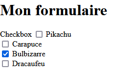

# Exercice 14

Ajouter une balise, sans sémantique et style particulier, avec id="pays" pour mieux identifier le pays au sein du paragraphe.

``` html
<body>
   <h1>France</h1>
   <p>Tout savoir sur la France : ses relations avec l'Union européenne, sa géographie, son économie, son histoire, sa culture, son drapeau et son hymne.</p>
</body>
```


# Exercice 15

Modifier le chemin de la première image pour qu'elle pointe dans le dossier img situé dans le dossier parent, et le chemin de la deuxième image pour qu'elle pointe dans le dossier bazar situé dans le dossier media.

``` html
<body>
   <p>Un French Connection est un cocktail composé de parts égales de cognac et d'amaretto.</p>
   <p></p>
   
   <p>Le Basil Smash est un cocktail rafraîchissant de gin, de citron, de sirop de sucre et de basilic frais.</p>
   <p></p>
</body>
```


# Exercice 16

En conservant les attributs, transformer la balise <input /> du formulaire en <textarea>.

``` html
<h1>Mon formulaire</h1>
<form>
   <label for="monexp">Mon expérience</label>
   <input type="text" id="monexp" name="monexp" value="Texte par défaut" />
</form>
```
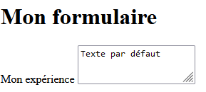

# Exercice 17

Écrire le code HTML du <body> pour obtenir le rendu ci-dessous.
Aperçu de l'exercice 17
Aperçu du rendu de l'exercice 17

``` html
<body>
   <h1>Gin Basil Smash</h1>
   <p>Créé en 2008 et aussi connu sous le nom <strong>Basil Smash</strong>, il à été mis au point par le mixologiste Jörg Meyer à Hambourg (Allemagne) en 2008. Ce délicieux cocktail moderne et simple est devenu très rapidement un classique dans le monde entier.</p>
   <p>Smash signifie "fracasser/piler" ou "grand succès", mais c'est aussi une catégorie de cocktails très en vogue dans les années 1840.</p>

   <h2>Ingrédients</h2>
   <ul>
      <li>8 feuilles de basilic</li>
      <li>1/2 citron</li>
      <li>2 cl de sirop de sucre de canne</li>
      <li>6 cl de gin</li>
   </ul>

   <h2>Préparation</h2>
   <ol>
      <li>Piler le basilic avec le jus d'un demi citron dans le shaker</li>
      <li>Ajouter les autres ingrédients ainsi que des glaçons et frapper</li>
      <li>Verser dans le verre à moitié rempli de glaçons en filtrant le contenu du shaker dans un verre de type "old fashioned"</li>
   </ol>
</body>
```
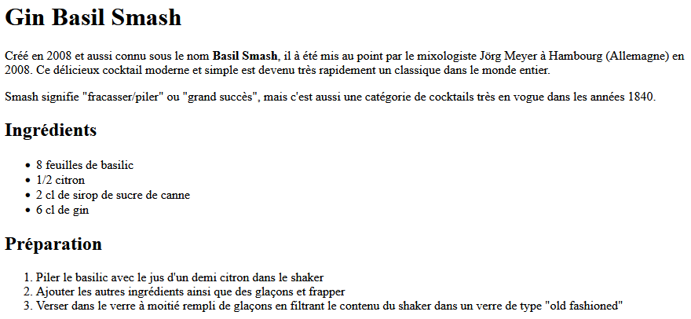

# Exercice 18

En utilisant cette image, écrire le code HTML du <body> pour obtenir le rendu ci-dessous.
Aperçu de l'exercice 18
Aperçu du rendu de l'exercice 18
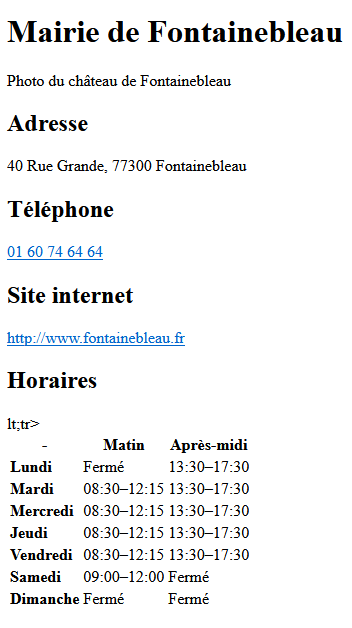

# Exercice 19

En utilisant les images ci-après, écrire le code HTML du <body> pour obtenir le rendu ci-dessous.

    Jim
    Sarah
    Arcturus

Aperçu de l'exercice 19
Aperçu du rendu de l'exercice 19
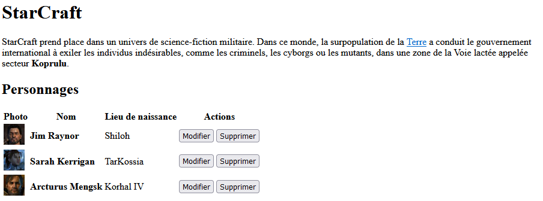

# Exercice 20

Écrire le code HTML du <body> pour obtenir le rendu ci-dessous.
Aperçu de l'exercice 20
Aperçu du rendu de l'exercice 20
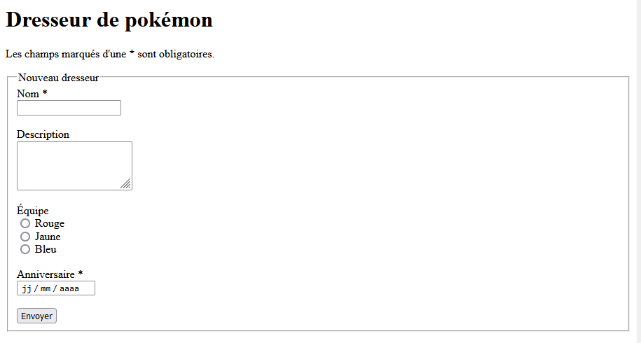

# Exercice 21

Modifier le code HTML du <form> pour ne plus obtenir d'erreurs et gagner le sésame. N'hésitez pas à soumettre le formulaire pour avoir des indications sur les points à modifier.

``` html
<form action="https://aymeric-auberton.fr/code/html/21.php" method="POST">
   <label for="color">Couleur</label>
   <input type="text" id="color" name="color" /><br />
   <br />
   <label for="ip">IP</label>
   <input type="ip" id="ip" name="ip" /><br />
   <br />
   <input type="submit" name="???" value="Valider" />
</form>
```
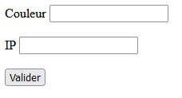

# Exercice 22

Modifier le code HTML du <form> pour envoyer à l'adresse indiqué trois champs :

    Un champ texte avec le nom title
    Une liste déroulante avec le nom category et les choixs : red, green, et blue
    Un champ caché avec le nom fantome et la valeur casper

``` html
<form action="https://aymeric-auberton.fr/code/html/22.php" method="POST">
   ...
   <input type="submit" value="Valider" />
</form>
```
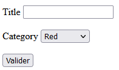